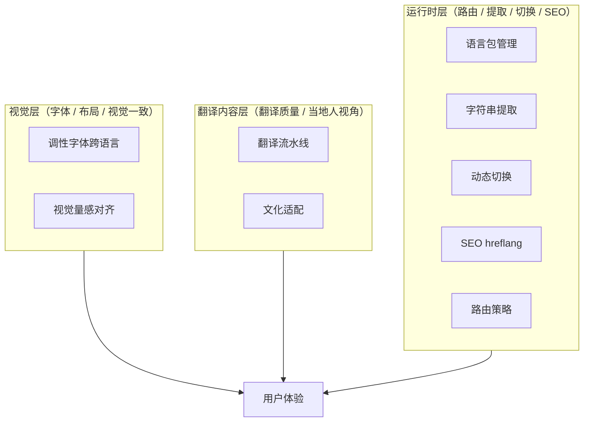

# 前端国际化（i18n）认知对齐

> [!info] 这篇是什么
> 做国际性网站时的 i18n 认知底座。偏原则本质、少量操作方案——目标是让下游 skill 和 AI 在具体项目里干活时有明确判断方向，不是操作手册。具体库选型（next-intl / i18next / react-intl 等）让 AI 按项目情况判断，本笔记只沉淀**判断标准和禁区**。
>
> 适用场景：新项目从零搭 / 老项目补多语言 / i18n 相关 debug。

## 核心心智模型：三层正交

i18n 不是一件事，是三件正交的事。混在一起想必乱。



**三层各自独立**：翻译内容再烂、运行时架构也可以对；字体再漂亮、翻译也可能别扭；路由再优、文化陷阱也能踩。评审和优化时**按层分开看**，一次只解一层的问题。

常见混淆：用户抱怨"网站不地道"时，问题可能在翻译层（机翻味）、视觉层（字体塌）、或运行时层（切语言把表单清空了）。先定位在哪一层，再进入该层的方法论。

## 四条元原则（跨所有层通用）

1. **用户视角 > 开发者视角** —— 管 fallback、错误展示、切换提示、任何"用户看到什么"的决策
2. **调性与一致性优先，性能次之** —— 字体、翻译、布局都尽量做到位，除非性能实测不合格否则不走兼容
3. **i18n 是成熟领域，用标准不造轮子** —— ICU MessageFormat / BCP 47 locale 码 / hreflang / CSS logical properties / 框架原生 i18n，都是事实标准
4. **分工隔离 + 并行可扩展** —— 本地化是天然的 subagent 并行任务，按 `locale × persona × domain` 切分

# 运行时层

## 1. 语言包

### 组织结构

**按业务区分文件**（`checkout.json` / `dashboard.json` / `auth.json`），加一个 `common.json` 兜底全局公共词（Yes / No / 确认 / 取消 / 通用错误）。

**不按 UI 零件分**（`buttons.json` / `errors.json`）：同一句"保存"在订单场景和头像场景含义不同，强拆会把同语境文案打散到多文件，改一次要跳好几个文件，翻译者看到孤立的"保存"没法判断译什么。

**不按页面分**（`login.json` / `home.json`）：页面结构会重构，按业务域分抗腐化。

**核心原则**：翻译的组织单位是**业务语境**，不是 UI 形态。

### key 命名

**按业务语义命名**（`user.profile.saveSuccess`），不按 UI 位置（`header.nav.login`）——UI 位置会随重构变化、业务语义不变。

**同语义不复用**：中英看似同义的句子，日文敬语级别不同、阿拉伯语性别分化、德语名词性可能变——共用 key 省几行代码，代价是翻译团队没法单独调一处语气。默认各写各的。

类比：咖啡做好的"好了"和打扫完的"好了"，日文是「お飲み物ができました」和「お掃除が完了しました」两句，代号不能共用。

### 缺翻译 fallback（按环境分层）

不是单选题，按环境走三套策略：

| 环境 | 策略 | 理由 |
|---|---|---|
| **生产** | 回退到默认语言 | 永远不让用户看到空白或 key 名 |
| **开发** | 显示 key 名 | 开发者一眼看到哪里漏翻 |
| **CI** | 核心语言漏翻 block 发版、次要语言 warning | 兜底 + 不阻塞 |

三场景差异：
- 新搭：生产 a + 开发 b + CI warning
- 补多语言：必须生产 a（老版本只有一种语言，新语言逐步补不能阻塞老用户）
- Debug：切开发模式用 b 定位问题 key

### 复数 / 性别 / 插值

**信任库原生语法**（ICU MessageFormat 或 i18next 的 plural/context）。

**禁止自己拼** `if (count === 1) ... else ...` —— 不同语言复数规则千差万别（阿拉伯语 6 种数、俄语 3 种），工程 workaround 永远写不全。

**禁止文案绕开**（如把"1 杯 / 2 杯"改成"数量：{count} 杯"）—— 文案质量主动倒退，仅纯 MVP 可接受。

**ICU 是 i18n 领域事实标准**，LLM 也认这个 DSL，机翻不会打乱。

> [!warning] 和翻译质量无关
> "相信库原生语法"只管**复数/性别的分叉规则用 DSL 声明**，不决定具体译文怎么写。翻译质量是翻译内容层的事，两件事正交。

## 2. 路由 / URL 策略

### URL 结构

| 形态 | 例 | 评价 |
|---|---|---|
| **子路径**（推荐） | `site.com/zh/about` | 业界默认。SEO 权重集中、成本低、分享含语言信息 |
| 子域名 | `zh.site.com/about` | SEO 每个子域独立积累、基础设施 × N；仅跨国集团分公司独立运营适用 |
| ccTLD | `site.cn` / `site.jp` | 本地合规信号最强；银行/政府/医疗/电商跨境专用 |
| 查询参数 | `site.com?lang=zh` | 禁用——SEO 最差、URL 丑、分享不稳 |

### 默认语言不带前缀

- `site.com` = 默认语言（如英文）
- `site.com/zh/` = 次要语言

理由：默认语言是主受众 URL 越短越好；补多语言不破坏老 SEO（原路径权重保住）。

**反方场景**：全新国际化项目、没有"主市场"、所有语言同等重要时，根路径 `site.com` 做语言选择页，所有语言都带前缀更对称。

### 首次访问的语言判定

**默认语言显示 + 温柔提示切换 + 记住选择**。禁止静默自动跳转。

三步流程：
1. 读 `Accept-Language`，与默认语言不匹配 → 顶部浮条"建议切换到中文？"
2. 用户点击才跳转；cookie + localStorage 双写
3. 回访读记忆直接跳

**自动跳转的三大坑**：
- VPN 误判（香港 IP 但用户是英文用户）
- 爬虫被错误分流（索引和实际不一致）
- 分享链接体验崩（朋友收到 `/zh/` 链接打开却被跳到 `/en/`）

### 切语言时 URL 变化

**必须改 URL、保持路径**：`/en/products/abc` → `/zh/products/abc`（同一商品页），不是跳首页。

路径参数、分页、锚点都保留，只换 `/{locale}/` 前缀。

### 缺语言回退

回退默认语言对应页 + toast 提示，不返回 404、不扔回首页。

用户最愤怒的是"我点的是具体商品页怎么回首页了"。

### locale 粒度

默认只区分语言（`/zh/` `/en/` `/ja/`），业务需要时才上地区（`/en-us/` `/en-gb/` `/pt-br/` `/pt-pt/`）或繁简（`/zh-hans/` `/zh-hant/`）。粒度够用即可。

## 3. SEO hreflang

### 本质

hreflang 是搜索引擎理解多语言网站的**唯一语义契约**——"同一内容的语言版本互相指认"的元数据声明。

没做 hreflang 的代价：搜索引擎把 `/en/about` 和 `/zh/about` 当成**两个独立无关的页面**，英文用户搜索时可能给出中文链接（反之亦然），跳出率高、SEO 权重被稀释。

### 三条硬约束

1. **双向声明** —— A 页声明 B、B 页也要声明 A，缺一 Google 整组忽略
2. **self-reference** —— 每个页面声明自己
3. **x-default 必填** —— 兜底给不在列表的语言用户

### 声明位置

| 方式 | 适合 |
|---|---|
| **HTML `<head>`** | 小中型站（< 1000 页），手工 / 模板可维护 |
| **sitemap.xml** | 大型站（> 1000 页），head 维护成本高 |
| HTTP `Link` header | 非 HTML 文件（PDF 等）专用 |

二选一，不叠加。

HTML head 最小示例（中文页）：

```html
<link rel="alternate" hreflang="zh" href="https://site.com/zh/products/abc" />
<link rel="alternate" hreflang="en" href="https://site.com/en/products/abc" />
<link rel="alternate" hreflang="ja" href="https://site.com/ja/products/abc" />
<link rel="alternate" hreflang="x-default" href="https://site.com/en/products/abc" />
```

### locale 严格按 ISO 码（最容易出 bug）

| 错误 | 正确 | 原因 |
|---|---|---|
| `jp` | **`ja`** | 日文 ISO 码是 ja，jp 是国家码 |
| `cn` | **`zh`** 或 `zh-CN` | 中文是 zh，cn 是国家码 |
| `en-uk` | **`en-GB`** | 英国代码是 GB |
| `zh_CN` | **`zh-CN`** | 连字符不是下划线 |
| `EN` | **`en`** | 语言码小写、地区码大写 |

### 三个致命陷阱（debug 必查）

1. **双向不一致** —— Google 直接忽略，一切白搭
2. **指向 404 / 301 重定向** —— 爬虫看到死链全部忽略
3. **和 `rel="canonical"` 冲突** —— 每个语言版本的 canonical 指向自己（不是默认语言），hreflang 负责兄弟关系、canonical 负责防 URL 参数重复

## 4. 字符串提取

### 工程边界

**只在"老项目补多语言"场景是工程**——新搭项目第一天就 `t('key')` 包裹，不存在提取问题。

### 路径推荐

**AI + 人工审 + subagent 并行**。

| 路径 | 评价 |
|---|---|
| 纯 AST codemod | 抓所有字符串字面量，抓不到语义决策（`console.log("debug")` 要不要提？） |
| 纯人肉 | 慢、错率高，成千上万行 |
| 纯 AI | 快但误抽 / 漏抽 |
| **✓ AI 扫 + 人工审 + 批量改** | 最平衡，AI 识别 + 给建议 key、人工做决策（提 / 跳过） |

**subagent 并行化**：按文件 / 业务域切，多个 subagent 并跑。大型项目 100+ 文件可 10 个 subagent 并行。

### 白名单（提）

- JSX 文本节点：`<button>保存</button>`
- 属性值：`alt` / `placeholder` / `title` / `aria-label`
- 动态生成的 UI 文案：`toast.success("保存成功")`
- 用户可见错误：`throw new UserFacingError("余额不足")`
- 枚举 label：`{ idle: "空闲", loading: "加载中" }`

### 黑名单（不提）

- `console.log` / `console.error`（开发者看的）
- 内部错误码 / 错误 type：`throw new Error("INVALID_TOKEN")` —— 是程序识别用，不是给用户看的
- 测试数据 / mock / 注释
- JSON 配置文件的 key
- CSS 类名 / 选择器字符串
- URL / API 路径

### 歧义用显式标记

硬编码注释 `// i18n-ignore` 显式跳过，比让 AI 猜可靠：

```ts
throw new Error("INVALID_TOKEN"); // i18n-ignore: internal error code
console.log("checkpoint reached"); // i18n-ignore: dev log
```

### key 命名

按业务语义（`checkout.payment.button.submit`），禁止 hash。

**禁用 hash key** 的理由：
- 翻译者看到 `a3f7bc29` 完全不知道译啥
- debug 时代码里搜 key 反向找文案是基操，hash 搜不到语义
- 只有极高保密项目（文案是商业机密）才考虑

### 提取后三项必做

| 校验项 | 工具 / 做法 |
|---|---|
| **漏抽**（还有硬编码） | ESLint：`eslint-plugin-i18next` / react-intl / `@intlify/eslint-plugin-vue-i18n` |
| **误抽**（不该提的被提） | AI 二次审，对黑白名单过一遍标记可疑 |
| **Key 去重** | 工具自动 dedup；近似文案（大小写 / 标点差异）人工决策 |

### 永久防御（日常硬约束）

- 编辑器实时：ESLint 插件 IDE 红线
- Commit 前：pre-commit hook 扫硬编码 block
- PR 合并前：CI 跑 lint 有硬编码 block merge

**提取是一次性工程，防御回归才是日常**。没有防御，三个月后项目又一堆硬编码还得再扫。

## 5. 动态切换

### 切换器 UX

- **位置**：右上角导航栏（Apple / Google / Microsoft / Stripe / Linear 全在这里）
- **形态**：< 5 语言下拉、> 5 模态面板（含搜索）
- **显示规则**：**每种语言用自己的文字展示自己**：

```
✓ 中文 / English / 日本語 / العربية / Español
× Chinese / English / Japanese / Arabic / Spanish
```

> [!warning] 防误切锁死
> 用户万一误切到葡萄牙语（Português），如果列表全用当前界面语言显示所有外语的翻译名，用户彻底迷路。**用目标语言的本土文字**让用户永远能切回来。

- **国旗图标**：可选但有争议。国家 ≠ 语言（英语不是英国独有、阿拉伯语 20+ 国），正式国际化建议只放文字。

### 刷新方式

| 方案 | 评价 |
|---|---|
| 整页硬刷新 `window.location.href` | 避免——白屏、状态丢、体验断裂 |
| **SPA 软切换** `router.push` + 懒加载 + re-render | **业界默认**。URL 变、状态保留、无白屏 |
| 纯 UI 切换（不变 URL） | 禁用——SEO 毁、分享链接带不到语言 |

**完整刷新流程（7 步）**：

```
用户点"中文"
  ↓
1. 读当前 URL path 去掉 locale 前缀（/en/products/abc → /products/abc）
  ↓
2. 拼接新 locale（/zh/products/abc）
  ↓
3. router.push('/zh/products/abc')
  ↓
4. 检测 zh 语言包是否已加载，未加载 fetch('/locales/zh.json')
  ↓
5. i18n 库更新 current locale → 触发所有 t('...') 重新求值
  ↓
6. 组件 re-render、页面内容变中文
  ↓
7. 写入 cookie（NEXT_LOCALE=zh），1 年过期
```

Next.js / Nuxt / Astro 都内置这套流程，几乎不用自己写。

### 切换时状态

| 状态 | 处理 |
|---|---|
| URL 路径 | 必保留——同页换语言不是跳首页 |
| 登录态 | 必保留 |
| 滚动位置 | 建议保留 |
| cookie / localStorage | 必保留 |
| **表单草稿** | 切换前弹窗确认："可能丢失未保存内容，是否继续？" |
| 语言派生缓存 | 必丢（已翻 tooltip、格式化日期等） |

**表单保护最容易漏**。用户结账页填一半切语言查条款，回来发现填的全没了——会骂街。

### 持久化

**cookie 优先，不是 localStorage**。SSR 首屏需要服务端读 cookie 才能给正确语言。

cookie key 按框架约定：Next.js 用 `NEXT_LOCALE`，通用可用 `i18n_locale`。过期 1 年，domain 设主域（`.site.com`）让子域共享。

### 性能

- 语言包按 locale 懒加载（`locales/en.json` / `locales/zh.json` 独立）
- < 100KB 切换几乎无感；> 500KB 加 loading state
- CDN 缓存 JSON、文件名含 hash（`zh.8a3f29.json`）解决缓存失效
- 热点语言预加载（用户浏览英文站时后台加载中文包）

# 翻译内容层

## 本地化翻译验证（整篇笔记的重心）

用户最担心的问题——"机翻直译 + 当地人看着古怪"。这一章是本篇 8 题里最关键的。

### 三段流水线

```
机翻 / AI 直译 → AI 本地人审 → 人工兜底敏感文案
```

- **第一段（机翻 / AI 直译）**：LLM 或 DeepL 出初稿，纯直译不追求地道
- **第二段（AI 本地人审，核心）**：另一个 AI 扮当地人读初稿、挑别扭、给建议
- **第三段（人工兜底）**：只审清单内高风险文案

**拆两段反而提质的原因**：一次出活时 AI 把"翻译"和"本地化"叠在一起思考，结果中庸。拆两段立场变了（第一段是翻译官、第二段是读者），挑刺视角天然触发。

### AI 本地人 persona 设定

| 粒度 | 效果 |
|---|---|
| 笼统（"你是日本人"） | 反馈平均化、等于没审 |
| 过度具体（"33 岁品牌策划、爱村上春树"） | 过拟合该 persona 偏好、失普适性 |
| **中等 + 多 persona 交叉（推荐）** | 3-5 个代表性画像（主力用户 + 边缘用户 + 高龄/低教育） |

**Prompt 模板**：

```
你是一名 [国籍] 用户，[年龄段]、[职业/身份]、[教育程度]、
[对本产品领域的熟悉度]。请以该身份读下面这段文案，告诉我：
1. 哪里读起来别扭、像机翻
2. 当地人会用什么更自然的说法
3. 有没有文化上不合适的词/概念
```

至少跑 3 个 persona，取并集。

### AI 审输出的结构化 schema

```
【别扭处】原文"[片段]"
【严重度】高/中/低（高=误解风险，中=不地道但能懂，低=语气偏好）
【建议】建议改成"[新译]"
【理由】当地人通常这么说因为...
```

**禁止让 AI 直接重写整段**——重写会让 AI 偏好覆盖原意，且开发者看不到修改理由。挑刺 + 建议 + 理由，决定权留给人。

**严重度分级是关键**：批量审时只有"高"和"中"值得回改，"低"基本是个人偏好忽略。

### 人工兜底清单（AI 不能独占决定权）

1. **法律 / 合规**：服务条款、隐私政策、免责声明 —— 错译有法律责任
2. **错误提示 / 报错文案**：用户焦虑时看到的内容，语气精度要求最高
3. **品牌 slogan / 首页主标题**：情绪浓度高、文化翻译性差
4. **支付 / 结账链路**：信任时刻，任何别扭感都损失转化
5. **客服话术**：直接代表品牌语气

### 文化陷阱 checklist（AI 审时必须显式过）

- **颜色**：红色中国喜庆 / 西方危险 / 某些场景阿拉伯凶兆
- **数字**：4 / 13 / 666 / 7 的文化含义
- **手势图标**：OK / 大拇指 / 摇手在不同文化含义反转
- **宗教**：食物成分、节日祝福、图像敏感
- **政治**：地图、国名、争议区域
- **幽默**：笑话基本不跨文化、双关语直接废

**不能只靠 AI 语感**——显式 checklist 过一遍，写进 prompt。

### Subagent 并行化（本层执行结构）

本地化工作三个结构特征天然匹配 subagent：

1. 任务可完美切分（N 语言 × M 业务域，片间独立）
2. 上下文需严格隔离（日本 persona 和阿拉伯 persona 共享会互相污染）
3. Prompt 模板高度一致（只差 locale / persona / checklist）

**三种 scale-out 模式**：

| 场景 | 切分维度 | 主 agent | Subagent |
|---|---|---|---|
| **A. 翻译初稿** | 按目标语言 | 发源文案 + 术语表 + locale | 按规范输出目标语 json |
| **B. 本地化审校** | 按 locale × persona | 汇总 N×M 份清单、去重 | 扮演画像、输出结构化审校 |
| **C. 业务域并行** | 按 locale × domain | 合并多域 json | 单域单语言翻译 + 审校 |

**主 agent 兜底三件事**：

1. **glossary 前置**：5 个 subagent 各译"登录"可能出现 Login / Sign In / ログイン / サインイン 混杂。先定 `glossary.json` 下发给每个 subagent 作为硬约束。
2. **key 完整性校验**：Subagent 可能漏 key / 错嵌套，主 agent 做 schema diff 对照源语言 json。
3. **文化陷阱注入**：每次 spawn 都把 checklist 塞进 prompt，不依赖 persona 自觉。

# 视觉层

## 字体视觉一致

### 三层优先级（最顶层认知）

| 层 | 何时主导 | 代价 |
|---|---|---|
| **1. 调性层** | 像素风 / 复古衬线 / 手写 / 赛博 / 极简几何——字体是产品人格 | 性能、一致量感都让路 |
| **2. 一致量感层** | 调性不强的商业网站 / 文档 / SaaS | 需 webfont 或配套家族 |
| **3. 性能层** | 追求首屏速度、品牌字不必须 | 视觉抖动可接受 |

**核心原则**：**尽量做到位，除非性能实测不合格否则不用"系统字体兼容"这种折中方案**。

### 视觉一致的四个维度

**量感对齐，不是字形对齐**：

- 字号
- 行高
- 视觉重量（黑度）
- x-height（小写字母高度）

笔画结构天生不同不可能一样，但消费者一眼能看出"这版比那版更粗、更挤、更瘦"——那就是量感在漂。

### 字体栈组织

**优先跨语言配套家族**，禁止手工拼 fallback：

- Google Noto Sans / Noto Serif 全家桶（Noto Sans SC / JP / KR / Arabic ...）—— 专门针对"跨语言视觉统一"做了量感对齐
- Apple 的 SF Pro + PingFang + Hiragino 系列 —— 系统层面配套
- 品牌字体场景：品牌字放前、Noto fallback

**手工拼 fallback 链**（如 `font-family: Helvetica, 微软雅黑, ...`）是老做法，两个字体作者没商量过、视觉基本会塌。

### CJK / Latin 混排

```css
font-family: "Noto Sans", "Noto Sans SC", sans-serif;
```

**Latin 优先、CJK fallback**。英文字母用 Noto Sans 渲染，画不出来的字符（中文）fallback 到 Noto Sans SC。

不要反过来——CJK 字体里的英文字母往往质量差、节奏塌。

例外：页面 95% 以上中文、英文只出现在身份证 / 订单号这类辅助信息时，反而 CJK 字体在前更整齐——实测。

### 调性字体跨语言的硬动作

调性承担设计基因时（像素风 / 复古 / 手写 / 赛博），字体是品牌资产，**跨语言必须贯彻同调性**。

像素风示例：
- 英文：Press Start 2P
- 中文：Fusion Pixel / 台北像素 / 缝合像素字体
- 日文：Misaki / 美咲ゴシック
- 阿拉伯语：专门像素阿拉伯字体或定制

**不能因为某语言找不到配套调性字体就降级成普通 sans-serif**——整站调性会塌。

执行硬动作：

1. 设计稿阶段就给出每种目标语言的配套字体方案，不到开发期再补
2. 缺字体的语言是硬约束——没有就不做该语言 / 预算定制 / 禁止降级
3. 字体文件许可证（商业使用权 / 修改权 / CDN 引用权）同步确认

### webfont vs 系统字体

**要用 webfont 就上全套 + 子集化**：

- Google Fonts 的 Noto 系列走 `&text=` 自动子集
- 自托管用 `fonttools subset` 按实际用字裁
- **禁止整包加载 CJK 字体**——几 MB 体积会让东京 / 上海用户首屏卡

无调性约束时默认 `system-ui` + 本地化字体栈（PingFang / 微软雅黑 / 苹方 / Noto）可接受，视觉一致性是次优但性能一流。

### 字体切换时机

90% 场景不需要——`font-family` 的 fallback 链自动触发。

只有极致追求时用 CSS `:lang()`：

```css
:lang(ja) body { font-family: "Noto Sans JP", sans-serif; }
:lang(ar) body { font-family: "Noto Naskh Arabic", serif; }
```

把每种语言强制绑到专属字体栈，代价是 CSS 变臃肿、维护成本高。

# 三场景速查

| 章节 | 新搭项目 | 补多语言 | Debug |
|---|---|---|---|
| **语言包** | 按业务域分 + 第一天接 ESLint + ICU 语法 | 保持老 URL 作为默认语言 | 查 fallback 配置、key 是否重复 |
| **路由** | 子路径 + 默认不带前缀 + 温柔提示 | 绝不改老 URL | 查查询参数 / 静默跳转 / URL 不变 |
| **hreflang** | 框架自动生成（Next.js i18n 中间件） | 新语言加时批量更新所有页面（subagent） | Search Console 国际定位报告 |
| **字符串提取** | 第一天接 ESLint 防御 | 一次性大工程：AI + subagent 扫 + 人审 + 批量改 + ESLint 兜底 | ESLint 扫漏抽、AI 审误抽 |
| **动态切换** | 框架原生 i18n + 右上角切换器 | 评估现有路由能否软切 | 查派生状态是否监听 locale |
| **翻译验证** | 三段流水线 + glossary + subagent | 首次全量 + 后续增量 | 重跑审校 subagent 看哪类别扭 |
| **字体** | 按调性定字体栈 + 第一天接好 | 调性是否覆盖已有 webfont | 测四国并排视觉重量 |

# 附录 A：RTL（备选中备选）

> [!info] 判定
> 目标市场**不含**中东（阿拉伯语 20+ 国）、以色列（希伯来语）、伊朗（波斯语）、巴基斯坦（乌尔都语）时，**不做 RTL 完全合理**。大多数 SaaS / 电商 / 内容站目标市场是中英日韩欧美语系全 LTR，直接跳过。

## 即便不做 RTL 也应采用的一件事：CSS logical properties

这是现代 CSS 最佳实践，代码质量收益不依赖 RTL 支持：

```css
/* 旧：物理方向 */
margin-left: 8px;
padding-right: 16px;
text-align: left;

/* 新：逻辑方向（推荐无论是否做 RTL） */
margin-inline-start: 8px;
padding-inline-end: 16px;
text-align: start;
```

Tailwind v3+ 用 `ms-` / `me-` / `ps-` / `pe-` 取代 `ml-` / `mr-` / `pl-` / `pr-`。

代价极小，未来若扩展到 RTL 市场省 10 倍返工成本。

## 真要做 RTL 时的完整清单（留档备用）

1. **全局开关**：`<html dir="rtl" lang="ar">`，SSR 时就定好（避免首屏闪烁）
2. **CSS 全用 logical properties**（核心）
3. **镜像白名单**：
   - 镜像：布局、方向性图标（箭头、撤销重做）
   - 不镜像：Logo、照片、地图、媒体控件（播放键朝右）、数字
4. **混合文本**：`<bdi>` 包裹用户输入、`dir="ltr"` 显式锁品牌名
5. **smoke test**：浏览器 console `document.documentElement.dir = 'rtl'`，错位处即漏了 logical properties

**决策逻辑**：预期扩展到 RTL 市场前 3 个月启动架构评估；完全不预期时只采用 logical properties。

# 对接 frontend-suite plugin

本认知笔记是以下 skill 的认知源：

| Skill（待建） | 触发时机 | 认知引用 |
|---|---|---|
| `frontend-suite:i18n-essentials` | 规划国际化网站架构 / 补多语言 / i18n debug | 本笔记全文 |

**分工原则**：
- 认知层（本笔记）：**原则 + 判断标准 + 禁区**，不给具体代码
- Skill 层：**执行模板 + prompt 模板 + 脚本 + 决策树**，调用本笔记作为 references

**落地节奏**：

- 先落单 skill（`i18n-essentials`），覆盖 7 题 + RTL 附录
- 跑过 3-5 次实战后评估是否拆 `i18n-setup` + `i18n-localize` 两块
- 跑过 5+ 次后考虑升格为 `i18n-suite` plugin（参照 [[10-工程协作/团队 GitLab 推送与 MR 实战手册|git-workflow 的 3-5 次实战再固化]] 演化节奏）

# 来源

- 2026-04-23 与 Claude 8 题深度采访（语言包 / 字体 / 本地化翻译验证 / 路由 / SEO hreflang / 字符串提取 / 动态切换 / RTL）
- 采访形式：决策式对话，Claude 给最佳实践 + 理由 + 三场景适配；用户确认 / 补充
- 用户关键补充：
  - 三层分层模型（运行时 / 翻译内容 / 视觉正交）—— 修正 Claude 初版把 i18n 库和翻译内容混为一谈的错误
  - 字体调性优先级（调性 > 一致 > 性能）—— 像素风跨语言贯彻不降级
  - Subagent 并行化作为本地化天然结构 —— `locale × persona × domain` 切分
  - RTL 降级为附录（目标市场暂不含中东 / 希伯来 / 波斯 / 乌尔都）

# Deletion-spec

- **触发删除条件**：当 8 题原则已被 `frontend-suite:i18n-essentials` skill 完整吸收且多次实战验证稳定、认知独立存活意义消失时，本笔记可降级为 signal → verified → 精简成骨架 + 链接到 skill
- **禁用方式**：删除本文件；`00-索引.md` 同步移除条目
- **卸载清单**：`frontend-suite:i18n-essentials` skill 的 references 段引用了本笔记；`11-前端工程/00-索引.md` 的文件列表引用了本笔记
